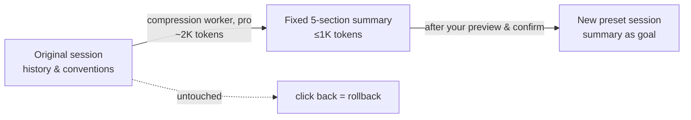

# dsh-plugin-bridge

[](https://github.com/deepseek-ai/deepseek-harness)
[](https://github.com/Totoro-qaq/dsh-plugin-bridge/actions/workflows/ci.yml)
[](LICENSE)
[](package.json)
[](https://github.com/deepseek-ai/deepseek-harness)
[](https://github.com/deepseek-ai/deepseek-harness)

[中文](README.md) | English

> **Ever wanted to switch presets mid-session and found the switch locked?** The lock is right (see below) — but it shouldn't be a dead end. This plugin is the exit: it **moves** a session across tool presets with a fixed-schema handoff summary instead of picking the official lock.



## Why this exists

### The rule is right: the lock protects you, it is not a defect

A preset is not a "tone dial" — it is a whole assembly: system prompt + tool set + plugins. Every tool call in a session's history (bash, file reads, edits) is legal only under the assembly that produced it. Swap the assembly mid-session and the new one may lack the old tools — leaving "ghost calls" in the history that it cannot execute. A model that sees calls to tools it doesn't have will at best behave erratically, at worst try to invoke things that don't exist.

The official gateway hard-locks mid-session preset switching (`agent-preset-locked`), and the source states plainly: "this is a product rule, not a mechanism constraint" — `recompose()` could technically swap (unmount, then mount), and they chose not to after thinking it through. Because a swap wouldn't error; it would **silently degrade**: the session keeps running, quality quietly drops, and you never learn why. A hard lock is far more honest than silent degradation.

The layering follows naturally: **model and thinking effort can switch mid-session** (swapping the "brain" doesn't invalidate history — that's exactly what `session.selectModel` does), **presets cannot** (swapping the "hands" breaks history). This plugin respects that layering exactly, in line with upstream.

### But a dead-end presentation makes it feel like a defect

The frustration doesn't come from the lock — it comes from **discovering it too late, with no exit once locked**: a static badge tells you "this road is closed" without saying what to do next. The rule shouldn't move; the missing piece is an exit.

### Bridge is that exit: move house, don't pick the lock

Compress the history → open a new session under the target preset → inject a fixed-schema summary as the new session's goal → send a handoff kickoff. **The original session is never touched; rolling back is just clicking back to it** (branch, not rollback).

Lossless migration is impossible in principle, so the design is "**lossy + previewable + verifiable + revertible**" = practically stable:

- **Previewable**: the full summary is shown and editable before anything happens — nothing runs without your confirmation (zero silence)
- **Verifiable**: a fixed five-section schema (Goal / Current state / Key decisions & conventions / Key files / Next step); the new session restates its understanding in the first turn, so missing facts are immediately visible
- **Revertible**: the original session is an immutable, read-only fact you can return to at any time

## Installation

```bash
dsh plugin --profile web add github:Totoro-qaq/dsh-plugin-bridge#main
# restart dsh web to take effect
```

`dsh plugin add` puts this package on the profile's `dsh.profile.bundles` layer stack (this package declares `dsh.bundle.patch` in its package.json). `lib/` ships prebuilt in the repo, so git installs need **no** pnpm ≥10 `allowBuilds` entry.

> ⚠️ **Extra token cost**: each migration costs ≈ ~2K tokens to compress + ≤1K tokens to inject (roughly one more message's worth). Measured data in "Token cost" below.

Changed your mind? Uninstall any time:

```bash
dsh plugin --profile web remove dsh-plugin-bridge   # restart dsh web to take effect
```

## Usage: no custom GUI required

This plugin ships an **agent skill** (`bridge`), not a UI component — it teaches the agent the migration flow and the fixed summary schema. The agent orchestrates; you confirm at the checkpoints.

**Official WebUI**: just tell the agent in the current session, e.g. "migrate this session to code mode" (optionally "with the pro compression tier"). The agent will:

1. Pull and fold the current history (`session.history`), collecting material under a hard character budget (full user messages + recent assistant conclusions + the latest compaction draft)
2. Spin up a **compression worker** (a throwaway minimal session, pro tier by default) that produces the fixed five-section summary, then archive the worker
3. **Show you the full summary for review** — nothing changes until you confirm (or edit)
4. Create a session under the target preset, attach the summary as its goal, send the kickoff, and switch over

**TotoroPilot (GUI)**: the same pipeline lives in a BridgeModal — target-preset dropdown, compression tier, editable summary preview, cost estimate, one-click confirm.

A full step-by-step guide with screenshots-level detail: [docs/guide.zh.md](docs/guide.zh.md) (中文).

## Token cost (measured, 2026-08-17)

**Per migration (user's view)**: the compression worker costs ~1.6K input / ~0.7K output, and the injected summary is ≤1K tokens — **about 2K tokens per migration, roughly one extra message**. That is the entire overhead; the original session accrues no further cost.

**The counterfactual (why those 2K are worth it)**: a bare restart that lets the agent scavenge conventions back from disk burned up to **2.2M** input tokens in a single run in our A/B — three orders of magnitude more, and it still drifted.

**Running the evaluation (developer's view)**: the eval burns your own tokens and is not in CI. Measured bills:

| Batch | Size | Uncached input | Cache-hit input | Output | Total |
|---|---|---|---|---|---|
| Full benchmark | 26 runs | 686K | 12.9M | 415K | ≈ 14.0M |
| A/B control | 8 runs | 266K | 5.1M | 112K | ≈ 5.5M |

93% of input hit the provider prompt cache (the planting and compression instructions are highly repetitive), so the billed cost is far below the headline numbers; cache hits are typically ~1/10 the uncached price — convert with your provider's rates.

## What's inside

- `src/compression.ts` — compression core (pure functions): `buildBridgeSource` (material collection), `buildBridgeInstruction` (fixed five-section schema), `buildBridgeKickoff` (first-turn handoff). Validated in 26 real runs (below).
- `src/index.ts` — Cordis bundle: registers the `bridge` skill + a config namespace (`modelTier` / `sourceCharBudget` / `summaryCharBudget`, overridable via `DSH_BRIDGE_*` env vars).
- `skills/bridge/SKILL.md` — the agent-facing migration manual (principles, RPC flow, tier guidance).
- `eval/` + `datasets/` — evaluation harness and test/validation splits.
- `docs/plan.md` — full design doc (token cost design, rollback design).

## Accuracy (2026-08, 26 real runs; full data in docs/benchmark.md)

| Metric | Test split T16 | Validation split V6 |
|---|---|---|
| Summary fidelity (facts in the worker summary) | 97.5% | 96.7% |
| **Probe usability (facts recallable after migration)** | **87.5%** | **83.3%** |
| Schema compliance (five-section headers) | 100% | 100% |

By configuration (test split):

| Compression tier | Probe usability | Worker cost |
|---|---|---|
| **pro (default)** | **95%**; 100% into cordis targets | ~2K tokens/run |
| flash | 80%; flash→minimal wiped out 2 of 3 runs | nearly identical |

More findings: **the source preset has zero effect on fidelity** (control group 4/4 at 5/5) — migration quality depends only on summary quality and target injection. Execution drift concentrates in "number rationalization" (ports completed to common values); paths barely drift. Failure modes are enumerated with mitigations (benchmark §7), and residual risk is absorbed by preview-confirm + the revertible original session.

## A/B: summary migration vs bare restart (2026-08, 8 paired runs)

Design: same fact planting (5 hard conventions), same probes and drift task; the **control arm** opens a new session carrying only the task title (the "restart under another preset" idea), the **treatment arm** runs the full bridge pipeline. Pro tier, code / minimal targets × 2 themes × 2 arms (`reports/ab-2026-08-17.raw.json`).

| Arm | Probe usability | Conventions carried into execution | Total input tokens |
|---|---|---|---|
| **bridge summary** | **19/20 (95%)** | 10/20 | **1.8M** |
| bare restart | 11/20 (55%) | 4/20 | 3.6M |

Key findings:

- Bare restart into **minimal** (no tools): 1/5 probe — genuine amnesia; every convention is lost.
- Bare restart into **code** (tools available): 4-5/5 probe, but the mechanism is a **scavenging loop of 25+ tool calls in the first turn** (one run burned 2.2M input tokens and hit the 240s turn cap) digging the conventions back out of host session logs (reproduce with `node eval/inspect-bare.mjs`). **Pricier, slower, and still drifting** (2/5) — and it depends on tools existing, on-disk logs, and model initiative. That's luck, not a plan.
- Conclusion: the summary's value is not just "remembering" — it is **remembering reliably, under any preset, at about half the token cost**. The "why" in the first chapter is now evidence, not argument.

## Testing & verification

- **27 unit tests** (`npm test`): compression behavior, summary-schema contracts (header order, per-section limits, anti-fabrication rules, budget consistency), and load smoke tests (plugin loads under a real Cordis `Context`; pends correctly when its `inject` is missing).
- **End-to-end on a real dsh install** (0.1.0-rc.6): `dsh plugin add` → reconcile appends the bundle to `dsh.profile.bundles` → `--dump-config` shows the bridge row → `pluginInventory/list` on a live host reports `fiberPhase: active`.
- CI additionally checks: `lib/` is in sync with `src/`, datasets parse, `npm pack` contents are complete.

## Running the evaluation yourself (burns your own tokens; not in CI)

```bash
# prerequisite: a local dsh web with model credentials configured
npm run eval            # full 26 runs (~40-60 min, tens of millions of input tokens)
BRIDGE_ONLY='^T0[13]$' npm run eval   # subset only
DSH_API=http://127.0.0.1:3080/api npm run eval 3
```

A/B control (summary migration vs bare restart):

```bash
BRIDGE_ARM=ab BRIDGE_TIER=pro BRIDGE_TO='^(code|minimal)$' BRIDGE_ONLY='^T1[1-4](-|$)' node eval/run.mjs 2
```

Datasets live in `datasets/` (test / validation splits with themes, fact expectations, probe and drift templates) — PRs with new themes are welcome.

## Engineering notes (learned the hard way)

- A cordis-preset session under open-ended prompts can enter long tool loops (a single turn >10 min); every eval turn has a watchdog that cancels on timeout — and killing the client process does **not** stop the host-side turn.
- The host RPC only archives (`workspace.archiveSession`), never deletes; physical deletion means stopping the host and cleaning `~/.dsh/sessions/`.

## License

MIT
