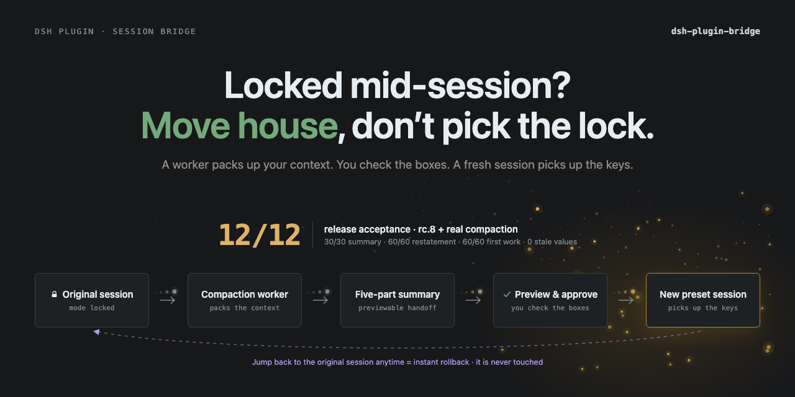

# dsh-plugin-bridge

<p align="center">
  
</p>

[](https://github.com/deepseek-ai/deepseek-harness)
[](https://github.com/Totoro-qaq/dsh-plugin-bridge/actions/workflows/ci.yml)
[](LICENSE)
[](package.json)
[](https://github.com/deepseek-ai/deepseek-harness)
[](https://github.com/Dominic789654/awesome-deepseek-harness)

English | [中文](README.zh.md)

Move a produced DeepSeek Harness session to another tool preset through a previewable, fixed-schema handoff. The original session stays untouched.

[Quick start](#quick-start) · [Safety and cost](#safety-and-cost) · [Accuracy](#accuracy) · [How it works](#how-it-works) · [Compatibility](#compatibility-and-limits)

## Quick start

```bash
dsh plugin --profile web add github:Totoro-qaq/dsh-plugin-bridge#v0.2.4
# restart dsh web once
```

Then type in the official WebUI:

```text
/bridge                       list available target presets
/bridge code                  preview the handoff; changes nothing
/bridge code --go             migrate, restate, then wait for confirmation
/bridge code --go --continue  restate and start work in the same target turn
```

The preview is editable. If a number or path is wrong, edit the printed summary file and run:

```text
/bridge code --go --file <path>
```

Uninstall with `dsh plugin --profile web remove dsh-plugin-bridge`, then restart `dsh web`.

> **Verified on the official rc.8 WebUI (2026-08-20):** clean install, plugin load, `standard → minimal` preview/migration, paused-goal persistence, and host restart. The package ships prebuilt `lib/`, so git installation needs no pnpm build-script allowlist.

## Safety and cost

Bridge optimizes for **high-fidelity, bounded-cost migration**:

- **Default — accuracy first:** the target restates the handoff in one short turn and waits. You verify it before any work starts.
- **`--continue` — lower latency/cost:** the target restates and begins the next step in the **same model request**.
- In both confirmation modes, any stored goal is paused before kickoff. The goal driver cannot silently queue another model round.
- If pausing fails, Bridge fails closed: it cancels automatic startup and sends no kickoff.
- Installing the plugin adds **zero prompt tokens** to normal sessions. `/bridge` is a host slash command, not a model tool or skill.

The release-acceptance run used one summary request per fixture. Confirm always reached first useful work in two target requests; `--continue` always did so in one. Token totals varied sharply with preset, output length, and cache state, so Bridge does not claim a universal percentage saving.

Observed across the fixed 12-cell release acceptance:

| Token measure | Nominal | Processed |
|---|---:|---:|
| Confirm extra vs `--continue`, pooled summary + first useful work | **+12.82%** | +52.56% |
| Confirm extra vs `--continue`, paired median | **+8.1%** | +65.6% |
| Summary worker share of the clean acceptance suite | **20.74%** | 16.71% |

Nominal is the primary comparison. Processed weights cache-read tokens equally and is not a bill; the worker row is a composition share, not causal overhead versus a no-Bridge baseline.

<details>
<summary><strong>Token definitions, ranges, and raw totals</strong></summary>

`Nominal = uncached input + output`; `processed` also includes cache-read/cache-write tokens and is a sensitivity measure, not a bill. “Summary + first useful work” excludes the pre-existing source conversation and official compaction cost.

Across the six paired fixtures, confirm's nominal extra had a median of +8.1% and a range of -47.9% to +206.7%; target-only nominal extra had a median of +11.0% and a range of -74.7% to +1059.1%. The wide spread is why request count is the stable product claim—not a fixed token-saving percentage.

The six fixed summary workers used 19,551 nominal / 26,463 processed tokens. The 12 target sessions used 74,716 / 131,932. Counting each shared summary once, the clean acceptance components totalled 94,267 / 158,395 tokens. See the [full report](reports/v0.2.3-e2e-report.md) and [raw JSON](reports/v0.2.3-e2e-2026-08-20T13-19-13-924Z.raw.json).

</details>

In short: the safe default deliberately spends a separate confirmation turn; `--continue` combines confirmation and useful work into one target turn without enabling a background goal round.

## Accuracy

The default compression tier is `pro`. The latest rc.8 release acceptance covered 6 frozen fixtures and 12 target sessions:

| Measure | Result |
|---|---:|
| Summary facts | **30/30** |
| Target restatement facts | **60/60** |
| First useful work facts | **60/60** |
| Critical facts | **90/90** |
| Obsolete-value resurrection | **0** |
| Exact confirm / continue request count | **6/6 · 6/6** |

This is a small, repair-driven release gate—not a statistical accuracy guarantee. It includes three 21-message sources with real compaction reuse plus three short sources, across minimal, standard, and code targets. Full methodology, raw token deltas, variability, and archive evidence are in the [v0.2.3 baseline + fix report](reports/v0.2.3-e2e-report.md).

<details>
<summary><strong>Earlier compression-tier benchmark</strong></summary>

The earlier August 2026 benchmark remains useful for comparing compression tiers:

| Measure | Result |
|---|---:|
| Summary fidelity | 97.5% test / 96.7% validation |
| Migrated fact usability | 87.5% test / 83.3% validation |
| `pro` fact usability (8 runs) | **95%** |
| `flash` fact usability (8 runs) | 80%, including one total-loss run |
| Five-section schema compliance | 100% |

`pro` and `flash` cost nearly the same here; the reason for defaulting to `pro` is lower failure variance, not a statistically proven mean advantage. Numbers and ports remain the main drift risk, which is why preview and restatement are part of the product path.

See [the earlier benchmark, A/B control, and known weaknesses](docs/benchmark.md).

</details>

## How it works

```text
fold history → generate five-part summary → preview/edit → create target session
             → pause stored goal → inject summary → restate (and optionally continue)
```

The five sections are Goal, Current state, Key decisions & conventions, Key files, and Next step. Tool traces from the old preset are intentionally dropped: Bridge moves state, not incompatible tool history.

The original session is never rewritten. If the migration is unsatisfactory, return to it and archive the new session.

<details>
<summary><strong>Why not switch the preset in place?</strong></summary>

A preset is a system prompt, tool set, and plugin composition—not a tone setting. Tool calls already stored in the session are only valid under the composition that produced them. DeepSeek Harness therefore allows `agentPreset.select` only while a session is blank; changing it later would leave ghost tool calls that the new preset cannot execute.

Bridge respects that boundary by opening a clean target session and carrying only a bounded handoff. Model and thinking-effort changes remain separate and can still happen inside a session.

</details>

<details>
<summary><strong>Official preset factory, <code>@</code> session references, and TotoroPilot</strong></summary>

- The official Agent Preset factory creates or configures presets for blank/future sessions. Bridge moves existing work into one of them.
- rc.8's `@` reference attaches a bounded read-only snapshot of another session to the current session. Bridge creates a new session and removes old-preset tool traces.
- **TotoroPilot** exposes the same migration pipeline through a GUI modal. The plugin itself remains usable directly in the official WebUI.

<p align="center">
  
</p>

</details>

## Compatibility and limits

Verified against DeepSeek Harness **0.1.0-rc.6, rc.7, and rc.8**, Node.js 22 and 24. Run `/bridge --doctor` after a Harness upgrade; it names missing gateway methods instead of failing vaguely.

- The official WebUI currently needs one restart after install and cannot let a plugin navigate to the session it creates. Bridge prints the exact title and session ID.
- Preview normally takes 20–60 seconds and is bounded by `previewTimeoutMs`.
- Release acceptance now covers real compaction reuse, but only one run per cell; it should not be read as a population guarantee.
- The older tier-comparison benchmark predates prompt+goal dual injection and remains labeled as historical evidence.

For the full walkthrough, rollback checklist, configuration table, CLI path, and FAQ, read the [Chinese usage guide](docs/guide.zh.md).

<details>
<summary><strong>Advanced CLI and configuration</strong></summary>

```bash
dsh-bridge doctor
dsh-bridge preview --to code --session <id>
dsh-bridge migrate --to code --summary-file <path> --continue
```

Main settings: `modelTier`, `sourceCharBudget`, `summaryCharBudget`, `goalRounds`, `inject`, `lang`, `workerProvider`, `workerModel`, and `previewTimeoutMs`. Configure them in the profile's `cordis.patch.yml` or through the matching `DSH_BRIDGE_*` environment variables documented in the guide.

The default injection mode is `both`: the summary is stored as a resumable goal and included in the kickoff prompt. The goal is paused before kickoff in both confirmation modes.

</details>

## Development

```bash
npm test          # build + typecheck + 112 tests
npm run pack:check
```

CI verifies Node 22/24, generated `lib/`, datasets, package contents, and the narrow upstream RPC/command contract. Tests use a fake host and spend no model tokens. Evaluation is separate and uses your own local model credentials; see [docs/benchmark.md](docs/benchmark.md).

## License

MIT
