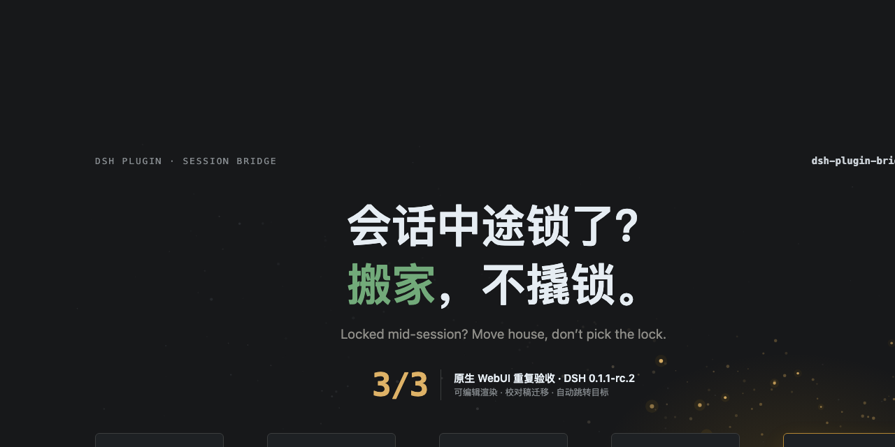

# dsh-plugin-bridge

<p align="center">
  
</p>

[](https://github.com/deepseek-ai/deepseek-harness)
[](https://github.com/Totoro-qaq/dsh-plugin-bridge/actions/workflows/ci.yml)
[](LICENSE)
[](package.json)
[](https://github.com/deepseek-ai/deepseek-harness)
[](https://github.com/awesome-dsh-plugin/awesome-dsh-plugin)

[English](README.md) | 中文

通过可预览、固定 schema 的交接，把已有内容的 DeepSeek Harness 会话迁到另一套工具 preset；原会话始终不动。

[快速开始](#快速开始) · [安全与成本](#安全与成本) · [准确率](#准确率) · [工作原理](#工作原理) · [兼容性](#兼容性与局限)

## 快速开始

```bash
dsh plugin --profile web add github:Totoro-qaq/dsh-plugin-bridge#v0.2.6
# 重启一次 dsh web
```

然后在官方 WebUI 输入：

```text
/bridge                       列出可迁入的 preset
/bridge code                  预览交接摘要，什么都不改
/bridge code --go             迁移、复述，然后等你确认
/bridge code --go --continue  在目标会话同一轮复述并开始工作
```

预览可编辑。数字或路径不对时，修改输出里打印的摘要文件，再执行：

```text
/bridge code --go --file <路径>
```

卸载：`dsh plugin --profile web remove dsh-plugin-bridge`，然后重启 `dsh web`。

> **最新实测——DSH 0.1.1-rc.2（2026-08-21）：**隔离安装、`/bridge` 注册、doctor 13/13、`standard → minimal` 预览与迁移、源 VLM 保持、未解析 PNG 原图搬运均通过；模型为 `deepseek-v4-flash-vision-exp`。rc.8 的完整生命周期与重启基线仍单独保留。

## 安全与成本

Bridge 的目标是：**高准确率、成本有界的迁移**。

- **默认模式——准确率优先：**目标会话用一个短轮次复述交接，然后等待；你确认无误后才开工。
- **`--continue`——更低延迟/成本：**目标会话在**同一次模型请求**里完成复述并开始下一步。
- 两种确认模式都会在 kickoff 前暂停已存储的 goal（如有），goal driver 不会静默追加模型轮次。
- pause 失败时 fail closed：取消自动启动，不发送 kickoff。
- 只安装、不迁移时，正常会话增加 **0 prompt token**。`/bridge` 是 host slash command，不是模型工具或 skill。
- 已有识图结果会在压缩摘要之外逐字搬运；只有尚未解析且目标能接图时才可能产生视觉 token。

release acceptance 中每个 fixture 只生成一次摘要。默认确认模式固定用 2 次目标请求抵达首次有效工作；`--continue` 固定用 1 次。实际 token 会随 preset、输出长度和缓存状态剧烈波动，所以本项目不宣称一个通用的固定节省百分比。

修复后的 12-cell release acceptance 实测：

| Token 指标 | Nominal | Processed |
|---|---:|---:|
| Confirm 相对 `--continue` 的额外成本，合并统计“摘要 + 首次有效工作” | **+12.82%** | +52.56% |
| Confirm 相对 `--continue` 的额外成本，配对中位数 | **+8.1%** | +65.6% |
| 摘要 worker 在干净验收组件中的占比 | **20.74%** | 16.71% |

主口径是 nominal。Processed 把 cache-read 等权计入，不等于账单；worker 这一行是构成占比，不是相对“无 Bridge”基线的因果增量。

<details>
<summary><strong>Token 定义、离散范围与原始总量</strong></summary>

`nominal = uncached input + output`；`processed` 还计入 cache-read/cache-write，是敏感性口径，不等于账单。“摘要 + 首次有效工作”不包含用户原会话的既有成本和官方 compaction 成本。

6 对 fixture 中，confirm 的 nominal 额外成本中位数为 +8.1%，范围 -47.9%～+206.7%；只看目标会话时，中位数为 +11.0%，范围 -74.7%～+1059.1%。离散度很大，所以稳定的产品结论是“少一次请求”，不是固定节省某个 token 百分比。

6 个修复后摘要 worker 共使用 19,551 nominal / 26,463 processed tokens；12 个目标会话共使用 74,716 / 131,932。每份共享摘要只计算一次时，干净验收组件合计 94,267 / 158,395 tokens。详见[完整报告](reports/v0.2.3-e2e-report.md)与[原始 JSON](reports/v0.2.3-e2e-2026-08-20T13-19-13-924Z.raw.json)。

</details>

一句话：安全默认值会明确多花一个“只复述”的确认轮；`--continue` 把确认和有效工作合并为一个目标轮，同时不开放后台 goal 轮次。

## 准确率

默认压缩档位为 `pro`。最新 rc.8 release acceptance 覆盖 6 份冻结 fixture 和 12 个目标会话：

| 指标 | 结果 |
|---|---:|
| 摘要事实 | **30/30** |
| 目标复述事实 | **60/60** |
| 首次有效工作事实 | **60/60** |
| 关键事实 | **90/90** |
| 旧值复活 | **0** |
| confirm / continue 请求数严格合规 | **6/6 · 6/6** |

这是小样本、修复驱动的发布 gate，不是统计意义的准确率保证。它包含 3 个真实复用 compaction 的 21 消息源会话与 3 个短会话，目标覆盖 minimal、standard、code。完整方法、逐请求 token、离散度与归档证据见 [v0.2.3 基线 + 修复报告](reports/v0.2.3-e2e-report.md)。

独立的 rc.2 视觉 gate 使用只存在于 PNG 内、不可猜的事实：

| 视觉路径 | 结果 | 重发原图 | 目标模型 |
|---|---:|---:|---|
| 已有识图回答 → 逐字视觉证据 | **5/5** | 0 | vision-exp |
| 未解析原图 → 安装版 `/bridge` 命令 | **5/5** | 1 | vision-exp |

安装版命令的摘要 worker + 目标首次回答共使用 1,770 nominal / 4,714 processed tokens。这是单个受控 fixture 的绝对值，不是通用开销百分比。详见 [rc.2 视觉报告](reports/v0.2.6-rc11-vision-report.md)。

<details>
<summary><strong>更早的压缩档位 benchmark</strong></summary>

更早的 2026 年 8 月 benchmark 仍用于比较压缩档位：

| 指标 | 结果 |
|---|---:|
| 摘要保真 | 测试 97.5% / 验证 96.7% |
| 迁移后事实可用性 | 测试 87.5% / 验证 83.3% |
| `pro` 事实可用性（8 runs） | **95%** |
| `flash` 事实可用性（8 runs） | 80%，含 1 次全灭 |
| 五段 schema 合规 | 100% |

`pro` 与 `flash` 在这里几乎同价；默认 `pro` 是因为失败方差更小，不是因为小样本已经证明均值显著更好。数字与端口仍是主要漂移风险，所以“预览 + 复述”属于产品主链路。

更早实验的完整方法、A/B 对照与已知弱点见 [benchmark](docs/benchmark.md)。

</details>

## 工作原理

```text
折叠历史 → 生成五段摘要 → 预览/编辑 → 创建目标会话
         → 暂停存储目标 → 注入摘要 → 复述（可选同轮继续）
图片历史 → 原样搬运关联助手正文；未解析原图走持久附件网关
```

五段分别是：目标、当前状态、关键决策与约定、关键文件、下一步。旧 preset 的工具痕迹会被主动丢弃：迁的是状态，不是与新工具集不兼容的调用历史。

原会话不会被改写。迁移不满意时，点回原会话并归档新会话即可。

<details>
<summary><strong>rc.8+ 图片：什么时候搬原图，什么时候搬原文</strong></summary>

Bridge 使用自动、准确率优先的图片策略：

- 只有图片、没有文字的用户消息不再从取材中静默消失。
- 图片同轮已有助手正文时，Bridge 将它逐字追加到 `视觉证据`，摘要 worker 无权改写。预览刻意称它为“关联助手响应”，而不是保证每个像素都已被理解。
- 图片后没有助手正文时标记为 `未解析`。在支持持久附件恢复的 host 上，Bridge 读取源会话附件，并尝试把原图放进目标 kickoff。
- kickoff 前，Bridge 会把源会话的 provider、model 与 reasoning effort 复制到空白目标，避免摘要 worker 的模型选择把视觉路由静默换掉。
- 视觉目标会收到原图与交接；默认纯文本 DeepSeek 会在 host 准入阶段拒绝图片，此时消息与模型请求尚未创建，Bridge 再自动发送带未解析警告的纯文本交接。
- 已有逐字证据时默认不重复发送原图，避免无必要的视觉 token 与缓存成本。如果原响应不足以支撑下一步，应从源会话重新附图核验。

普通五段摘要仍受 `summaryCharBudget` 约束，默认 2,400 字符。逐字视觉证据使用独立的 60,000 字符预算，并以完整块为单位纳入：超限时会明确省略较早整块，但绝不会从一段图片结论中间截断。复制已有文字不增加模型轮次；原图成功进入视觉目标时，图片成本由所选视觉模型提供方计算。

rc.6/rc.7 继续走文本兼容路径。原图读取只是 rc.8+ 的可选网关能力，不会被加入 `/bridge --doctor` 的必需方法集合；0.1.1-rc.2 + `deepseek-v4-flash-vision-exp` 的完整原图迁移已实测通过。

</details>

<details>
<summary><strong>为什么不在原会话直接切 preset？</strong></summary>

preset 是系统提示、工具集和插件的完整组装，不是语气档位。历史里的工具调用只在生成它们的组装下合法。DeepSeek Harness 因此只允许空会话执行 `agentPreset.select`；中途切换会留下新 preset 无法执行的“幽灵调用”。

Bridge 尊重这个边界：建立干净的目标会话，只携带一份有界交接。模型与思考强度仍是另一层，可以在会话内正常切换。

</details>

<details>
<summary><strong>官方 preset 工厂、<code>@</code> 会话引用与 TotoroPilot</strong></summary>

- 官方 Agent Preset 工厂用于给空白/未来会话创建和配置 preset；Bridge 用于把已有工作迁进其中一个 preset。
- rc.8 的 `@` 引用把另一会话的有界只读快照加到当前会话；Bridge 新建会话，并去掉旧 preset 的工具痕迹。
- **TotoroPilot** 用 GUI 弹窗承载同一迁移流水线；本插件本身可以直接在官方 WebUI 使用。

<p align="center">
  
</p>

</details>

## 兼容性与局限

已核对 DeepSeek Harness **0.1.0-rc.6、rc.7、rc.8 与 0.1.1-rc.2**，CI 覆盖 Node.js 22/24。升级 Harness 后可先运行 `/bridge --doctor`；缺少哪个网关方法会被直接点名。

- 官方 WebUI 安装后目前需要重启一次，也不允许插件自动跳转到新建会话；Bridge 会打印准确标题与 session ID。
- DeepSeek 文本路由仍不能读图。未解析图片应使用 `deepseek-v4-flash-vision-exp` 等视觉路由；Bridge 会把源模型选择保留到目标，并在附件不可复用时明确降级，不会暗中运行本地小视觉模型。
- 预览通常需要 20–60 秒，受 `previewTimeoutMs` 上限保护。
- release acceptance 已覆盖真实 compaction 复用，但每个 cell 仅 1 次，不应理解为总体保证值。
- 更早的档位对比数据早于 prompt+goal 双注入，继续作为带边界的历史证据。

完整操作、回退清单、配置表、CLI 路径与 FAQ 见 [中文使用指南](docs/guide.zh.md)。

<details>
<summary><strong>高级 CLI 与配置</strong></summary>

```bash
dsh-bridge doctor
dsh-bridge preview --to code --session <id>
dsh-bridge migrate --to code --summary-file <路径> --continue
```

主要配置：`modelTier`、`sourceCharBudget`、`summaryCharBudget`、`goalRounds`、`inject`、`lang`、`workerProvider`、`workerModel`、`previewTimeoutMs`。写入 profile 的 `cordis.patch.yml`，或使用指南中的 `DSH_BRIDGE_*` 环境变量。

默认注入方式是 `both`：摘要既存为可恢复的 goal，也进入 kickoff prompt。两种确认模式都会先暂停 goal。

</details>

## 开发验证

```bash
npm test          # build + typecheck + 121 tests
npm run pack:check
```

CI 检查 Node 22/24、生成的 `lib/`、数据集、安装包内容与上游 RPC/command 窄契约。测试使用 fake host，不消耗模型 token；评测另行运行并使用本机模型凭据，详见 [benchmark](docs/benchmark.md)。

社区收录：[Awesome DSH Plugin](https://github.com/awesome-dsh-plugin/awesome-dsh-plugin) · [Awesome DeepSeek Harness](https://github.com/Dominic789654/awesome-deepseek-harness)

## License

MIT
